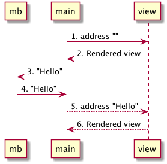

# Using the mailbox

The next step is to use the mailbox in our application so we can send and refresh messages.


```elm
module Main (..) where

import Html exposing (Html)
import Html.Events as Events


view : Signal.Address String -> String -> Html
view address message =
  Html.div
    []
    [ Html.div [] [ Html.text message ]
    , Html.button
        [ Events.onClick address "Hello"
        ]
        [ Html.text "Click" ]
    ]


mb : Signal.Mailbox String
mb =
  Signal.mailbox ""


main : Signal Html
main =
  Signal.map (view mb.address) mb.signal
```

<https://github.com/sporto/elm-tutorial-assets/blob/master/code/020_signals/Mailbox02.elm>

#### view

```elm
view : Signal.Address String -> String -> Html
view address message =
  Html.div
    []
    [ Html.div [] [ Html.text message ]
    , Html.button
        [ Events.onClick address "Hello"
        ]
        [ Html.text "Click" ]
    ]
```

The `view` function now takes a `Signal.Address` as first argument.

`Events.onClick address "Hello"` sets an event listener that listens for clicks on this Html element. `onClick` sends the given message (e.g. "Hello") to the given address each time this element is clicked.

#### main

```elm
main : Signal Html
main =
  Signal.map (view mb.address) mb.signal
```

In `main` we do two things:

- Create a partially applied view `(view mb.address)`, so the view always gets the `address` of our mailbox as first argument.

- And map the output signal of our __mailbox__ to this partially applied view. `view` will get the value coming from the mailbox signal as second argument.

---

Here is a diagram to help clarify what is happening:



- __(1)__ Initially `main` renders the view by passing the mailbox's address and the mailbox initial value (empty string)
- __(2)__ When the view is rendered we set an event listener on the button by using `onClick`
- __(3)__ When the button is clicked as message is sent to the mailbox's address
- __(4)__ Upon receiving the message the mailbox emits a value on its signal which is picked up by main
- __(5)__ `main` then renders the view again by passing the mailbox's address and the message coming from the mailbox ("Hello")

### Conclusion

Mailboxes are communication hubs, they receive messages from our UI and broadcast them to other parts of our application. They are an integral building block when creating complex web applications.

