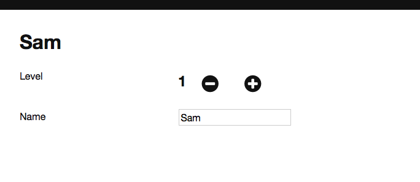

> This tutorial has been upgraded from Hop 2.1 to Hop 3.0 on 20-03-2016, if you started the Routing chapter before that please review from the back to the beginning of the chapter.

# Try it

We have added the necessary wiring to have a working router.

Try it:

- Going to `http://localhost:3000/#/players` should show you a list of player
- Going to `http://localhost:3000/#/players/1/edit` should show you the player edit view
- Going to `http://localhost:3000/#/xyz` should show you "Not found"

In summary:

- When the browser location changes Hop matches our route definitions (e.g. `/players/:id/edit` -> `ShowPlayerEdit`) and sends a message (e.g. `ShowPlayerEdit`) to the StartApp mailbox
- StartApp triggers the necessary updates which reach the Routing module
- The Routing module sets the view to `PlayerEditView` in the model
- StartApp then re-renders the application using the new model

At this point your application code should look like <https://github.com/sporto/elm-tutorial-app/tree/060-routing>

Next step is to add some navigation.

