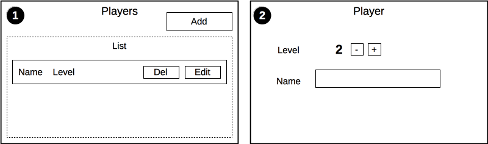

# Planning

We will build an application that tracks an imaginary roll playing game.

This application will demonstrate:

- Multiple views
- Nested components
- Breaking the application into resources
- Routing
- Shared state across the application
- CRUD operations
- Ajax requests

### Resources

During the rest of this guide I will use the word __resources__ to refer to models that are the subject of our application. These are __players__ in this application. Using the word __model__ can be confusing because component specific state is also a model (for example the expanded / collapse state of a component).

## Wireframes

The application will have two views:

### Screen 1

Will show a list of players, from here you can:

- Add a player
- Delete a player
- Navigate to edit a player

### Screen 2

Shows the edit view for a player. In this screen you can:

- Change the name
- Change the level
