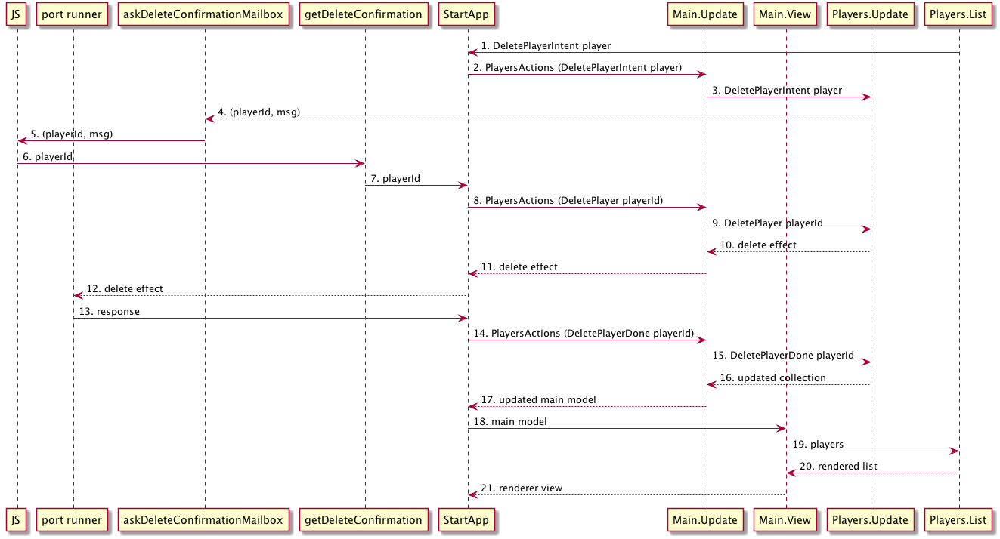

# Plan

Deleting a player will follow the same pattern than adding a player but with one complication: we want to show a conformation dialogue before removing the player.

The steps for this will be:

- When the user clicks the delete button trigger an action (`DeletePlayerIntent`) with the intention of deleting a player
- This action will trigger a call to a port that sends a message to JavaScript
- JavaScript listens to this port and shows a window confirmation dialogue
- If the user clicks yes we send a message to Elm via another port
- This inbound port triggers an action `DeletePlayer`
- This action triggers the actual deletion.
