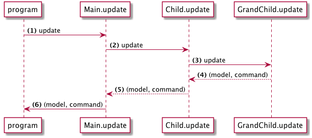

> This page covers Elm 0.18

# Commands

In Elm, commands (Cmd) are how we tell the runtime to execute things that involve side effects. For example:

- Generate a random number
- Make an http request
- Save something into local storage

A `Cmd` can be one or a collection of things to do. We use commands to gather all the things that need to happen and hand them to the runtime. Then the runtime will execute them and feed the results back to the application.

In other words, every function returns a value in a functional language such as Elm.  Function side effects in the traditional sense are forbidden by the language design and Elm takes an alternative approach to modeling them.  Essentially, a function returns a command value which names the desired effect.  Due to the Elm architecture, the main Html.program we've been using is the ultimate recipient of this command value.  The update method of the Html.program then contains the logic to execute the named command.

Let's try an example app using commands:

```elm
module Main exposing (..)

import Html exposing (Html, div, button, text, program)
import Html.Events exposing (onClick)
import Random


-- MODEL


type alias Model =
    Int


init : ( Model, Cmd Msg )
init =
    ( 1, Cmd.none )


-- MESSAGES


type Msg
    = Roll
    | OnResult Int


-- VIEW


view : Model -> Html Msg
view model =
    div []
        [ button [ onClick Roll ] [ text "Roll" ]
        , text (toString model)
        ]


-- UPDATE


update : Msg -> Model -> ( Model, Cmd Msg )
update msg model =
    case msg of
        Roll ->
            ( model, Random.generate OnResult (Random.int 1 6) )

        OnResult res ->
            ( res, Cmd.none )


-- MAIN


main : Program Never Model Msg
main =
    program
        { init = init
        , view = view
        , update = update
        , subscriptions = (always Sub.none)
        }
```

If you run this application it will show a button that will generate a random number each time you click it.

---

Let's review the relevant parts:


### Messages

```elm
type Msg
    = Roll
    | OnResult Int
```

We have two possible messages in our application. `Roll` for rolling a new number. `OnResult` for getting a generated number back from the `Random` library.

### Update

```elm
update : Msg -> Model -> ( Model, Cmd Msg )
update msg model =
    case msg of
        Roll ->
            ( model, Random.generate➊ OnResult (Random.int 1 6) )

        OnResult res ->
            ( res, Cmd.none )
```

➊ `Random.generate` creates a command that will generate random numbers. This function requires the first argument to be a constructor for the message that will be fed back to our application. In this case our constructor is `OnResult`.

So when the command is run Elm will call `OnResult` with the generated number, producing `OnResult 2` for example. Then __Html.program__ will feed this message back to application.

In case you're wondering, `OnResult res` denotes a message, OnResult, containing an additional payload of information, the Integer 'res' in this case.  This pattern is known as parameterized types.

---

In a bigger application with many nested components we can potentially send many commands at once to __Html.program__. Take this diagram for example:



Here we collect commands from three different levels. At the end we send all these commands to __program__ to run.
