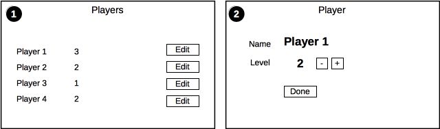

> This page covers Tutorial v2. Elm 0.18.

# Planning

We will build a basic application to track an imaginary role playing game.

### Resources

During the rest of this guide I will use the word __resources__ to refer to models that are the subject of our application. These are __players__ in this application. Using the word __model__ can be confusing because component specific state is also a model (for example the expanded / collapse state of a component).

## Wireframes

The application will have two views:

### Screen 1

Will show a list of players. From here you can:

- Navigate to edit a player

### Screen 2

Shows the edit view for a player. In this screen you can:

- Change the level

This is a very simple application that will demonstrate:

- Multiple views
- Nested components
- Breaking the application into resources
- Routing
- Shared state across the application
- Read and edit operation on the records
- Ajax requests