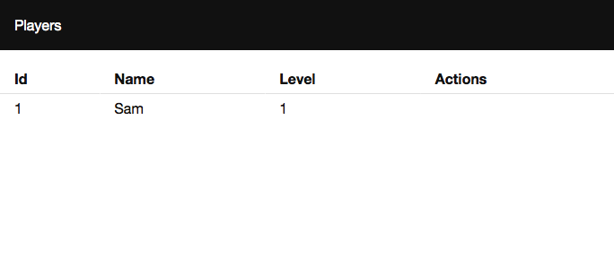

> This page covers Tutorial v2. Elm 0.18.

# Main View

Modify __src/View.elm__ to include the list of players:

```elm
module View exposing (..)

import Html exposing (Html, div, text)
import Msgs exposing (Msg)
import Models exposing (Model)
import Players.List


view : Model -> Html Msg
view model =
    div []
        [ page model ]


page : Model -> Html Msg
page model =
    Players.List.view model.players
```

---

When you run the application you should see a list with one user.



The application should look like <https://github.com/sporto/elm-tutorial-app/tree/018-v02-04-resources>