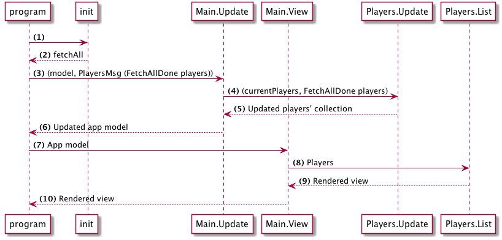

> This page covers Tutorial v2. Elm 0.18.

# Plan

The next step is to fetch the list of players from the fake API we created before.

This is the plan:



(1-2) When the application loads, we trigger a command to initiate an Http request to fetch the players. This will be done in the `init` of Html.program.

(3-4) When the request is done, we trigger a `OnFetchPlayers` with the response, this message flows to `Update` which updates the model by storing the response.

(5) Then the application renders with the updated players' list.

## Dependencies

We will need a few new packages, install them using:

```bash
elm package install elm-lang/http 
elm package install NoRedInk/elm-decode-pipeline 
elm package install krisajenkins/remotedata
```

- `elm-lang/http` is used for sending http requests.
- `NoRedInk/elm-decode-pipeline` offers and alternative and cleaner API for decoding JSON.
- `krisajenkins/remotedata` offers a robust pattern for handling remote resources, we will talk more about this later.
