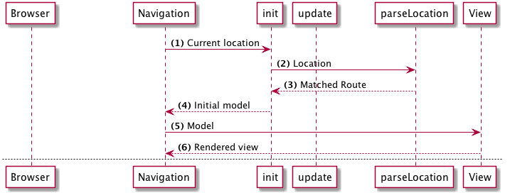
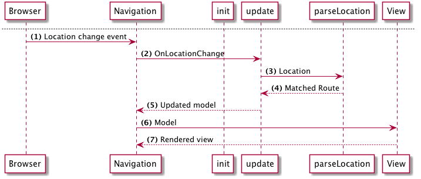

> This page covers Tutorial v2. Elm 0.18.

# Routing introduction

Let's add a routing to our application. We will be using the [Elm Navigation package](http://package.elm-lang.org/packages/elm-lang/navigation/) and [UrlParser](http://package.elm-lang.org/packages/evancz/url-parser/).

- Navigation provides the means to change the browser location and respond to changes
- UrlParser provides route matchers

First install the packages:

```bash
elm package install elm-lang/navigation
elm package install evancz/url-parser
```

 `Navigation` is a library that wraps `Html.program`. It has all the functionality of `Html.program` plus some extra things:

 - Listens for location changes on the browser
 - Triggers a message when the location changes
 - Provides ways of changing the browser location

## Flow

Here are a couple of diagrams to understand how routing will work.

### Initial render



- (1) When the page first loads the `Navigation` module will fetch the current `Location` and send it to the application `init` function.
- (2) In `init` we parse this location and get a matching `Route`.
- (3, 4) We then store this matched `Route` in our initial model and return this model to `Navigation`.
- (5, 6) `Navigation` then renders the view by sending this initial model.

### When the location changes



- (1) When the browser location changes the Navigation library receives an event
- (2) A `OnLocationChange` message is sent to our `update` function. This message will contain the new `Location`.
- (3, 4) In `update` we parse the `Location` and return the matching `Route`.
- (5) From `update` we return the updated model which contains the update `Route`.
- (6, 7) Navigation then renders the application as normal


