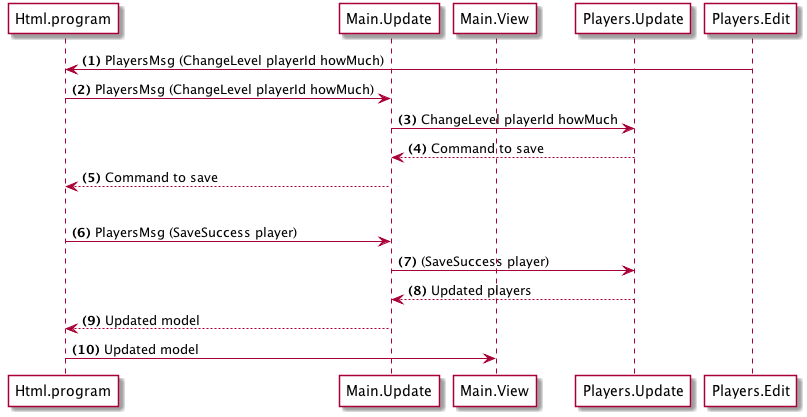

> This page covers Tutorial v2. Elm 0.18.

# Plan

The plan for changing a player's level is as follows:

(1) When the user clicks the increase or decrease button we trigger a message `ChangeLevel` with the `player` and `howMuch` as payload.

(2) __Html.program__ (which Navigation wraps) will send this message back to `Update`.

(3) `Update` will return a command to save the player.

(4) The Elm runtime executes the command (trigger an API call) and we will get a result back, which is either a successful save or a failure. In the success case we trigger a `OnPlayerSave` message with the updated player as payload.

(5) In `Update` we update the `players` model and return it.

(6) Then Html.program will render the application with the updated model.
