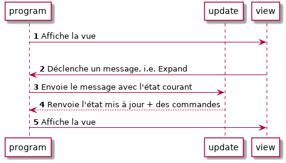

# Flux d'une application

Le diagramme suivant illustre comment les pièces de notre application interagissent avec Html.App.

1. Html.App appelle notre fonction `view` avec le modèle initial et l'affiche.
1. Lorsque l'utilisateur clique sur le bouton _Expand_, la vue déclenche le message `Expand`.
1. Html.App reçoit le message `Expand` qui appelle notre fonction `update` avec comme paramètres `Expand` et l'état actuel de notre application.
1. La fonction `update` répond au message en retournant l'état mis à jour et une commande à exécuter (ou aucune avec `Cmd.none`).
1. Html.App reçoit l'état mis à jour, le stocke, et appelle la vue avec l'état mis à jour.

Habituellement, l'état d'une application Elm se trouve uniquement au sein d'Html.App, il est centralisé dans un grand arbre d'état.
