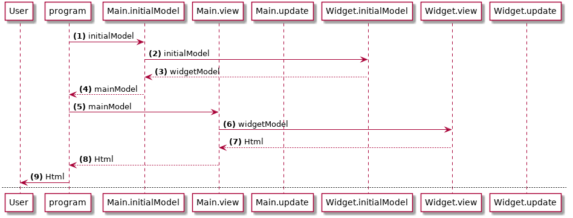
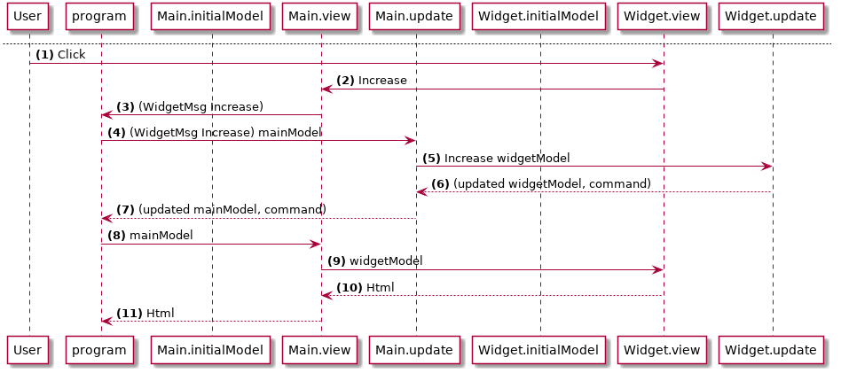

# Composition

Ci-dessous deux diagrammes qui illustrent cette architecture :

### Affichage initial

(1) __App__ appelle __Main.initialModel__ pour obtenir le modèle initial de l'application.

(2) __Main__ appelle __Widget.initialModel__

(3) __Widget__ retourne son modèle initial

(4) __Main__ retourne un modèle principal composé, qui inclut le modèle du widget

(5) __App__ appelle __Main.view__ en lui passant le modèle principal __mainModel__

(6) __Main.view__ appelle __Widget.view__, en lui passant __widgetModel__ du modèle principal

(7) __Widget.view__ retourne l'Html calculé à __Main__

(8) __Main.view__ retourne l'Html calculé à __App__

(9) __App__ affiche le tout dans le navigateur.

---

### Interactions avec l'utilisateur

(1) L'utilisateur clique sur le bouton _increase_.

(2) __Widget.view__ émet un message __Increase__ qui est récupéré par __Main.view__.

(3) __Main.view__ étiquette ce message de manière à ce qu'il devienne `WidgetMsg Increase` et il est ensuite envoyé à __App__ 

(4) __App__ appelle __Main.update__ avec ce message et le modèle principal

(5) Puisque le message a été étiqueté avec  __WidgetMsg__, __Main.update__ délègue la mise à jour à  __Widget.update__, qu'il prend soin d'appeler avec la partie __widgetModel__ du modèle principal

(6) __Widget.update__ modifie le modèle en fonction du message reçu, dans notre cas, __Increase__. Il retourne ensuite le __widgetModel__ modifié plus une commande

(7) __Main.update__ met à jour le modèle principal et le retourne à  __App__

(8) Ensuite __App__ affiche de nouveau la vue en passant le modèle principal mis à jour

## Points clés

- L'architecture Elm offre une manière propre de composer (ou d'imbriquer) des éléments sur autant de niveaux qu'on le souhaite.
- Les composants enfants n'ont pas besoin de connaitre quoi que ce soit du parent. Ils définissent leurs propres types et leurs propres messages.
- Si un composant enfant à besoin de quelque chose en particulier (par exemple, un modèle additionnel), il le « demande » en utilisant les signatures de fonction. C'est le parent qui a la responsabilité de fournir ce dont l'enfant a besoin.
- Un parent n'a pas besoin de savoir ce qui se passe dans les modèles de ses enfants, ou quels sont leurs messages. Il a juste en charge de fournir ce que les enfants demandent.
