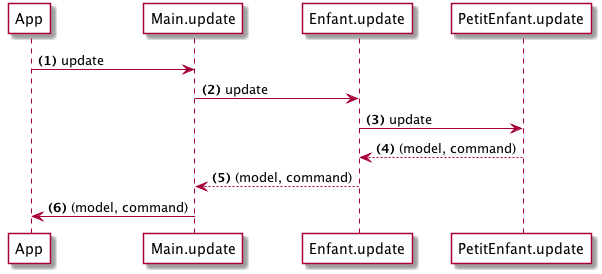

> This page covers Elm 0.18

# Commandes

En Elm, les commandes (Cmd) sont utilisées pour demander à l'environnement Elm d'exécuter des actions qui causent des effets de bord (*side effects*). Par exemple :

- générer un nombre aléatoire
- faire une requête HTTP
- enregistrer quelque chose dans le "localStorage" du navigateur

Une `cmd` peut être une chose à faire, ou une collection de ces choses. On utilise des commandes pour rassembler toutes les choses qui doivent se produire, et les transmettre à l'environnement Elm. Il se charge de les exécuter et de transmettre leur résultat à l'application.

Dans les langages fonctionnels, comme Elm, chaque fonction doit retourner une valeur. Les fonctions à effets de bord sont interdites par la conception même du langage.
Elm a adopté une approche différente pour les modéliser : une fonction retourne une valeur de type commande, qui désigne l'effet désiré.
Conformément à l'architecture Elm, le programme principal Html.App est le destinataire final de cette valeur de type commande. La méthode de mise à jour (*update*) du programme Html.App contient la logique pour exécuter la commande nommée.

Voyons une application d'exemple qui utilise des commandes :

```elm
module Main exposing (..)

import Html exposing (Html, div, button, text)
import Html.Events exposing (onClick)
import Random


-- MODEL


type alias Model =
    Int


init : ( Model, Cmd Msg )
init =
    ( 1, Cmd.none )


-- MESSAGES


type Msg
    = Roll
    | OnResult Int


-- VIEW


view : Model -> Html Msg
view model =
    div []
        [ button [ onClick Roll ] [ text "Roll" ]
        , text (toString model)
        ]


-- UPDATE


update : Msg -> Model -> ( Model, Cmd Msg )
update msg model =
    case msg of
        Roll ->
            ( model, Random.generate OnResult (Random.int 1 6) )

        OnResult res ->
            ( res, Cmd.none )


-- MAIN


main : Program Never Model Msg
main =
    program
        { init = init
        , view = view
        , update = update
        , subscriptions = (always Sub.none)
        }
```

Si vous exécutez cette application, vous verrez un bouton qui va générer un nombre aléatoire à chaque clic.

---

Étudions les parties intéressantes :


### Messages

```elm
type Msg
    = Roll
    | OnResult Int
```

Il y a deux messages possibles dans notre application : `Roll` pour demander à générer un nouveau nombre, et `OnResult` pour récupérer le nombre généré par la bibliothèque `Random`.

### Mise à jour

```elm
update : Msg -> Model -> ( Model, Cmd Msg )
update msg model =
    case msg of
        Roll ->
            ( model, Random.generate➊ OnResult (Random.int 1 6) )

        OnResult res ->
            ( res, Cmd.none )
```

➊ `Random.generate` crée une commande qui va générer des nombres aléatoires. Cette fonction prend en premier argument un constructeur pour le message qui sera renvoyé à l'application. Dans notre cas, il s'agit de `OnResult`.

Ainsi, lorsque la commande est exécutée, Elm va appeler `OnResult` avec le nombre généré, pour produire par exemple `OnResult 2`. Puis, __Html.App__ va renvoyer ce message à l'application.

Si vous vous posez la question, sachez que `OnResult res` représente un message (OnResult) qui contient une information supplémentaire (res). On appelle cela des types paramétrisés (*parameterized types*).

---

Dans une plus grande application avec de nombreux composants imbriqués, on peut potentiellement envoyer plusieurs commandes à la fois à __Html.App__, comme on le voit dans ce diagramme :



Ici, on collecte les commandes de trois différents niveaux. Ces commandes sont ensuite envoyées à __Elm.App__ pour être exécutées.
