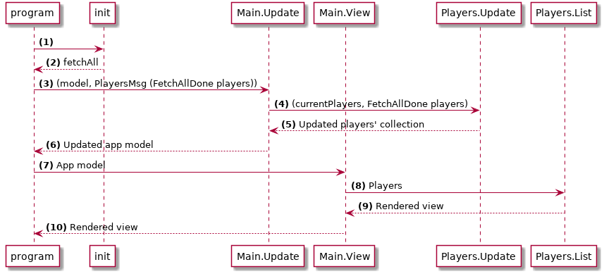

# Plan

La première étape est de récupérer une liste des joueurs depuis la fausse API que nous avons créée plus tôt.

Voilà le plan :



(1-2) Quand l'application se charge, on déclenche une commande pour initier une requête HTTP pour récupérer les joueurs. Cela sera fait dans la fonction `init` de Html.App.

(3-6) Quand la requête a été effectuée, on envoie un message `FetchAllDone` avec les données ; ce message arrive jusqu'à `Players.Update` qui met à jour la collection de Joueurs.

(7-10) Enfin, l'application s'affiche, avec la liste des Joueurs à jour.

## Dépendances

Nous aurons besoin du paquet `http`. Pour l'installer, lancez :

```bash
elm package install evancz/elm-http
```
