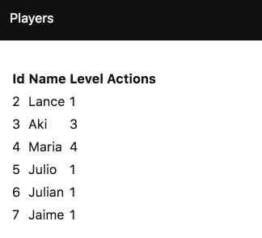

# Essayez !

Essayons ce que nous avons fait jusqu'à présent. Lancez l'application en tapant :

```bash
npm run dev
```

 dans un terminal et :

```bash
npm run api
```

dans un autre.

Ensuite, ouvrez `http://localhost:3000` dans votre navigateur. Vous devriez voir une liste d'utilisateurs.



Si vous allez sur `http://localhost:3000/#players/2` vous devriez voir un utilisateur.


Nous allons maintenant ajouter la navigation.

---

Il y a d'autres bibliothèques de correspondances que `UrlParser`, par exemple [Hop](https://github.com/sporto/hop).
