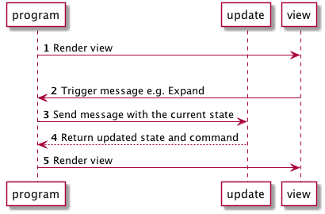

>このページでは、Elm 0.18

# アプリケーションフロー

次の図は、アプリケーションの部分がHtml.Appとどのように対話するかを示しています。

1. `Html.program`は、初期モデルでビュー関数を呼び出してレンダリングします。
1. ユーザが「Expand」ボタンをクリックすると、ビューは「Expand」メッセージをトリガします。
1. `Html.program`は`Expand`メッセージを受け取り、`Expand`メッセージと現在のアプリケーション状態を受け取る`update`を呼び出します。
1. `update`関数は、更新された状態と実行するコマンド(または `Cmd.none`)を返すことによって、メッセージに反応します。
1. `Html.program`は更新された状態を受け取り、それを保存し、更新された状態を引数としてビューを呼び出します。

通常、 `Html.program`はElmアプリケーションが状態を保持する唯一の場所です。一つの大きな状態ツリーに集中しています。
