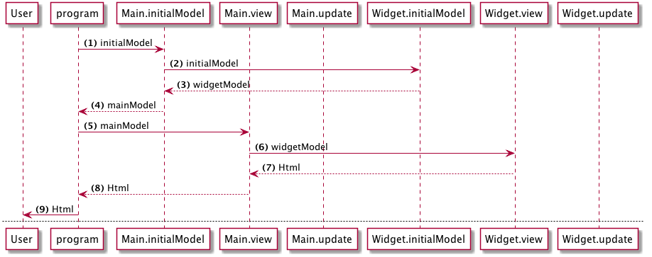
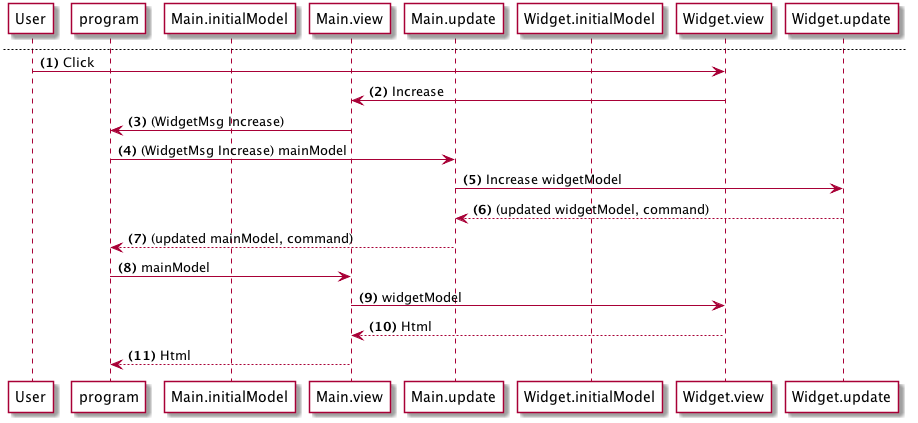

>This page covers Elm 0.18

# 合成

このアーキテクチャを説明する2つの図があります。

### 初期レンダリング

(1)__program__はアプリケーションの初期モデルを取得するために__Main.initialModel__を呼び出します

(2)__Main__は__Widget.initialModel__を呼び出します

(3)__Widget__は初期モデルを返します

(4)__Main__は、ウィジェットのモデルを含む合成されたメインのモデルを返します

(5)__program__は __メインのモデル__を渡して__Main.view__を呼び出します

(6)__Main.view__はメインモデルから__widgetModel__を渡して__Widget.view__を呼び出します

(7)__Widget.view__はレンダリングされたHTMLを__Main__に返します

(8)__Main.view__はレンダリングされたHTMLを__program__に返します

(9)__program__はこれをブラウザにレンダリングします

---

### ユーザーインタラクション

(1)ユーザが増加ボタンをクリックする

(2)__Widget.view__は、__Main.view__によって拾われる__Increase__メッセージを発行します。

(3)__Main.view__はこのメッセージにタグを付けて(WidgetMsg Increase)、__program__に送信します

(4)このメッセージとメインモデルで__program__が__Main.update__を呼び出す

(5)メッセージに__WidgetMsg__というタグが付いているので、__Main.update__は更新を__Widget.update__に委譲し、メインモデル一部である__widgetModel__部分を渡します

(6)__Widget.update__は、指定されたメッセージ(この場合は__Increase__)に従ってモデルを変更し、修正された__widgetModel__とコマンドを返します

(7)__Main.update__はメインモデルを更新し、それを__program__に返します

(8)__program__は、更新されたメインモデルを渡してビューを再びレンダリングします

## キーポイント

- Elmアーキテクチャは、必要なだけ多くのレベルでコンポーネントを合成する(または入れ子にする)クリーンな方法を提供します。
- 子コンポーネントは、その親について何も知る必要はありません。子コンポーネントは、独自の型とメッセージを定義します。
- 子コンポーネントが特に何か(例えば、追加のモデル)を必要とする場合、関数シグネチャを使用して「必要である」と宣言します。親は、子供が必要とするものを提供する責任があります。
- 親は子どものモデルに何が含まれているのか、そのメッセージが何であるかを知る必要はありません。必要なのは、子供たちが求めているものを提供することだけです。
