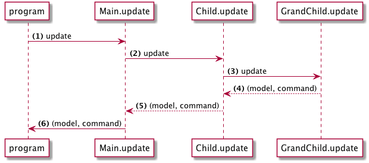

>このページでは、Elm 0.17

# コマンド

Elmでは、コマンド(Cmd)は、副作用を伴うものを実行するようにランタイムに指示する方法です。例えば：

- 乱数を生成する。
- httpリクエストを作成する。
- 何かをローカルストレージに保存する。

などです。`Cmd`は、行うべき事柄の1つ、または集合です。私たちはコマンドを使用して、実行する必要があるすべてのものを収集し、それらをランタイムに渡します。ランタイムはそれらを実行し、結果をアプリケーションにフィードバックします。

Elmなどの関数型言語では、すべての関数は値を返します。伝統的な意味での関数の副作用は言語設計によって禁止されており、Elmはそれらをモデリングするための代替アプローチを採用しています。本質的には、関数は、望む効果を表すコマンドの値を返します。 Elmアーキテクチャで使ってきたmainのHtml.Appプログラムは、このコマンド値を最終的に受けとります。 Html.Appプログラムのupdateメソッドには、名前付きコマンドを実行するロジックが含まれています。

コマンドを使ったサンプルアプリケーションを試してみましょう：

```elm
module Main exposing (..)

import Html exposing (Html, div, button, text)
import Html.Events exposing (onClick)
import Html.App
import Random


-- モデル


type alias Model =
    Int


init : ( Model, Cmd Msg )
init =
    ( 1, Cmd.none )


-- メッセージ


type Msg
    = Roll
    | OnResult Int


-- VIEW


view : Model -> Html Msg
view model =
    div []
        [ button [ onClick Roll ] [ text "Roll" ]
        , text (toString model)
        ]


-- 更新


update : Msg -> Model -> ( Model, Cmd Msg )
update msg model =
    case msg of
        Roll ->
            ( model, Random.generate OnResult (Random.int 1 6) )

        OnResult res ->
            ( res, Cmd.none )


-- MAIN


main : Program Never
main =
    Html.App.program
        { init = init
        , view = view
        , update = update
        , subscriptions = (always Sub.none)
        }
```

このアプリケーションを実行すると、クリックするたびに乱数を生成するボタンが表示されます。

---

関連する部分を見てみましょう：


### メッセージ

```elm
type Msg
    = Roll
    | OnResult Int
```

アプリケーションには2つのメッセージがあります。次に新しい数字を表示するための `Roll`。生成された数値を `Random`ライブラリから取得するための`OnResult`です。

### 更新

```elm
update : Msg -> Model -> ( Model, Cmd Msg )
update msg model =
    case msg of
        Roll ->
            ( model, Random.generate➊ OnResult (Random.int 1 6) )

        OnResult res ->
            ( res, Cmd.none )
```

➊ `Random.generate`は乱数を生成するコマンドを作成します。この関数は、最初の引数がアプリケーションにフィードバックされるメッセージのコンストラクタである必要があります。この場合、コンストラクタは `OnResult`です。

コマンドが実行されると、Elmは生成された数字で `OnResult`を呼び出し、例えば`OnResult 2`を生成します。 __Html.App__はこのメッセージをアプリケーションに送り返します。

疑問に思うかもしれませんが、`OnResult res`はメッセージOnResultを示します。この場合、情報の追加ペイロードInteger 'res'を含みます。これは「パラメータ化された型」として知られているパターンです。

---

多くのネストされたコンポーネントを持つより大きなアプリケーションでは、一度に多くのコマンドを__Html.App__に送信する可能性があります。次の図を見てください：



ここでは、3つの異なるレベルからコマンドを収集します。最後に、これらのコマンドをすべて__Elm.App__に送信して実行します。
