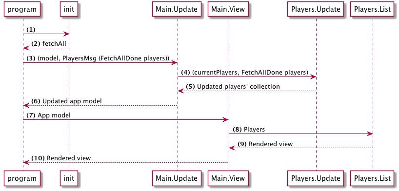

# 計画

次のステップは、前に作成した偽のAPIからプレーヤのリストを取得することです。

これは計画です：



(1-2)アプリケーションがロードされると、Httpリクエストを開始してプレイヤーを取得するコマンドを起動します。 これはHtml.programの `init`で行われます。

(3-6)リクエストが完了すると、データとともに「FetchAllDone」をトリガーします。このメッセージはプレーヤーのコレクションを更新する `Players.Update`に流れます。

(7-10)その後、アプリケーションは更新されたプレーヤーのリストをレンダリングします。

## 依存関係

`http`モジュールが必要なのでインストールしておきます：

```bash
elm package install elm-lang/http
```
