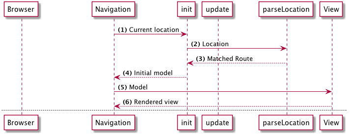
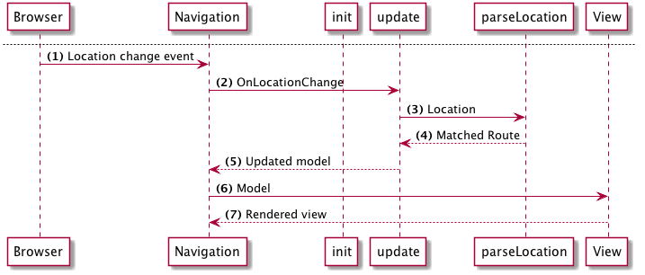

# ルーティングの紹介

アプリケーションにルーティングを追加しましょう。 [Elm Navigation package](http://package.elm-lang.org/packages/elm-lang/navigation/)と[UrlParser](http://package.elm-lang.org/packages/evancz/url-parser/)を使用します。

- ナビゲーションはブラウザの場所を変更し、変更に対応する手段を提供します
- UrlParserはルートマッチャーを提供します

最初にパッケージをインストールします。

```bash
elm package install elm-lang/navigation 1.0.0
elm package install evancz/url-parser 1.0.0
```

`Navigation`は`Html.App`をラップするライブラリです。 `Html.App`のすべての機能といくつかの余分な機能を備えています：

 - ブラウザ上でのロケーションの変更を待ち受る
 - 場所が変更されたときに私たちが提供する機能を呼び出す
 - ブラウザの場所を変更する方法を提供する

## フロー

ルーティングの仕組みを理解するための図をいくつか示します。

### 初期レンダリング



1. ページが最初に読み込まれるとき、 `Navigation`モジュールは現在のURLを取得し、それを私たちが提供する`parse`関数に送ります。
1. この`parse`関数は、一致する`Route`を返します。
1. ナビゲーションは、この一致した `Route`をアプリケーションの`init`関数に送ります。
1. `init`ではアプリケーションモデルを作成し、そこに一致するルートを格納します。
1. ナビゲーションは、最初のモデルをビューに送信して、アプリケーションをレンダリングします。

### ロケーションが変更されたとき



1. ブラウザーの場所が変更されると、ナビゲーション・ライブラリーはイベントを受け取ります
1. 新しい場所は以前と同じように `parse`関数に送られます
1. `parse`は一致したルートを返します
1. 次に、 `Navigation`は`urlUpdate`関数を呼び出して、マッチしたルートを渡します
1. `urlUpdate`では、マッチしたルートをアプリケーションモデルに格納し、更新モデルを返します
1. ナビゲーションはアプリケーションを通常通りレンダリングします
