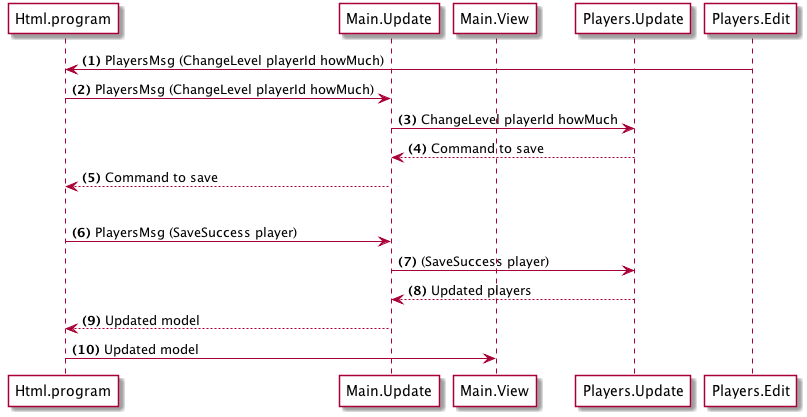

# 計画

プレーヤーのレベルを変更する計画は次のとおりです。

(1) ユーザーが増加、減少のボタンをクリックすると、 `playerId`と`howMuch`をペイロードとして、 `ChangeLevel`メッセージをトリガーします。

(2) __Html.program__(ナビゲーションがラップしている)は、このメッセージを `Main.Update`に送り返し、`Players.Update`(3)に送ります。

(4) `Players.Update`はプレーヤーを保存するコマンドを返します。このコマンドは__Html.program__(5)に流れます。

(6) Elmランタイムはコマンドを実行し(API呼び出しをトリガする)、保存成功または失敗のいずれかの結果を返します。 成功の場合、更新されたプレーヤーをペイロードとして「SaveSuccess」メッセージをトリガーします。

(7) `Main.Update`は`SaveSuccess`メッセージを `Players.Update`にルーティングします。

(8) `Players.Update`では`players`モデルを更新して返します。 これはHtml.program(9)に戻ります。

(10) その後、Html.programは更新されたモデルでアプリケーションをレンダリングします。
