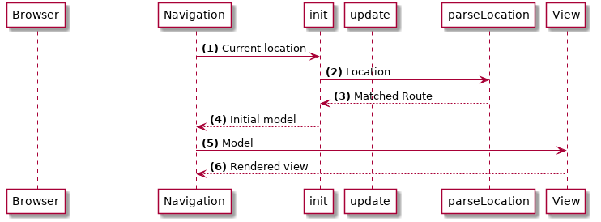

> This page covers Elm 0.18

# 라우팅 시작하기

어플리케이션에 라우팅을 추가해 봅시다. [Elm Navigation package](http://package.elm-lang.org/packages/elm-lang/navigation/) 와 [UrlParser](http://package.elm-lang.org/packages/evancz/url-parser/) 를 사용하겠습니다.

- Navigation 은 브라우저 주소 변경을 감지하고 대응할 수 있게 해 줍니다.
- UrlParser 는 루트 매쳐를 제공합니다.

패키지부터 설치합니다:

```bash
elm package install elm-lang/navigation
elm package install evancz/url-parser
```

`Navigation` 은 `Html.program` 을 감싸는 라이브러리입니다. 기존 `Html.program` 의 기능에 더해 아래 일들을 수행합니다:

- 브라우저의 주소 변경 감지
- 주소 변경 시 메시지 발생시킴
- 브라우저 주소 변경 가능

## 흐름

라우팅이 어떤 식으로 동작하는지 다이어그램과 함께 살펴보겠습니다.

### 초기 렌더링



- (1) 페이지가 뜨면 `Navigation` 모듈은 현재의 `Location` 을 읽어들여 `init` 함수로 전달합니다.
- (2) `init` 으로 전달된 로케이션은 우리가 파싱하여 매치되는 `Route` 를 찾습니다.
- (3, 4) 찾은 `Route` 는 모델에 담겨 `Navigation` 으로 리턴됩니다.
- (5, 6) `Navigation` 은 이 모델로 뷰를 그립니다.

### 주소 (location) 변경 시


- (1) 브라우저 주소가 변경될 때 Navigation 라이브러리는 이벤트를 받습니다.
- (2) `OnLocationChange` 메시지가 우리 앱의 `update` 함수로 전달됩니다. 이 메시지는 새로운 `Location` 을 담고 있습니다.
- (3, 4) `update` 에서 우리는 `Location` 를 파싱하여 매치되는 `Route` 를 구합니다.
- (5) `update` 에서 새 `Route` 를 담은 모델을 리턴합니다.
- (6, 7) Navigation 에서 다시 뷰를 그립니다.
