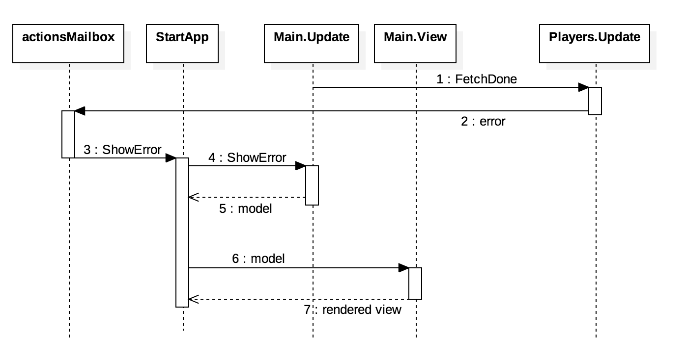
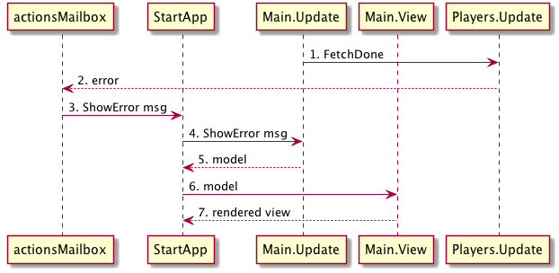

# Flow

We have a view where to show errors and an attribute on the model. This is the plan for adding the errors:

- Upon getting __FetchDone__, if there is an error __Player.Update__ will return an effect that sends a message to a mailbox (`actionsMailbox`)
- Messages to this mailbox are wrapped with the `ShowError` action
- This mailbox's signal will be an input of StartApp, so all messages going to this mailbox will flow to the main application
- __Main.Update__ picks up the `ShowError` action and set the error in the model
- The view renders with the error message in the model