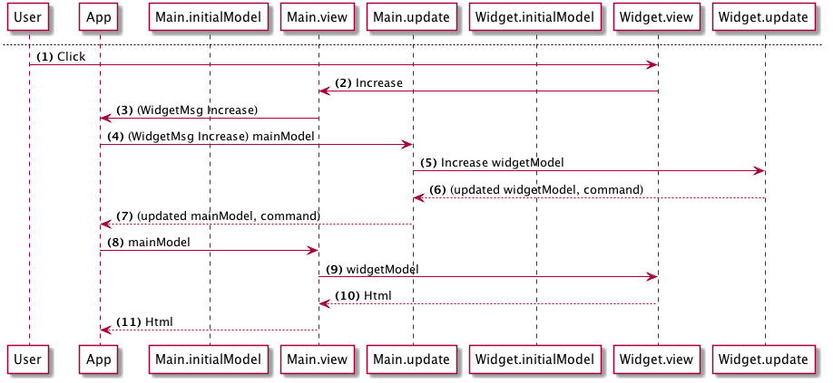

# 組成 - 資料流

下面有兩張圖表描繪此架構：

### 初始轉譯

(1) __App__ 呼叫 __Main.initialModel__ 取得應用程式的初始模型

(2) __Main__ 呼叫 __Widget.initialModel__

(3) __Widget__ 傳回其初始模型

(4) __Main__ 傳回組合的主模型，包含 widget 的模型

(5) __App__ 呼叫 __Main.view__，帶入__主模型__

(6) __Main.view__ 呼叫 __Widget.view__，帶入主模型內的__widgetModel__

(7) __Widget.view__ 傳回轉譯後的 Html 給 __Main__

(8) __Main.view__ 傳回轉譯後的 Html 給 __App__

(9) __App__ 在瀏覽器轉譯結果。

---

### 使用者互動

(1) 使用者點擊 increase 按鈕

(2) __Widget.view__ 發出 __Increase__ 訊息，由 __Main.view__ 取得。

(3) __Main.view__ 加標籤在訊息，變成（WidgetMsg Increase）並送到 __App__

(4) __App__ 呼叫 __Main.update__ 帶入訊息及主模型

(5) 因為訊息已標上 __WidgetMsg__ 標籤，__Main.update__ 將更新委派到 __Widget.update__，連同主模型中__widgetModel__部份一併送去

(6) __Widget.update__ 根據給定的訊息更新模型，此例為 __Increase__。傳回更新後 __widgetModel__ 加上一個命令

(7) __Main.update__ 更新主模型並傳回給 __App__

(8) __App__ 帶入更新後模型再次轉譯視界

## 關鍵點

- Elm 架構提供一個乾淨的方式組合（或巢狀）元件，無論層級有多少。
- 子元件完全不了解其父元件。他們定義了自己的型別與訊息。
- 如果子元件特別需要什麼（例如，額外的模型），它必須透過函式標記式來"請求"。父元件負責提供子元件所需。
- 父元件不需要了解其子元件的模型或訊息。它只需要提供子元件需要的即可。
