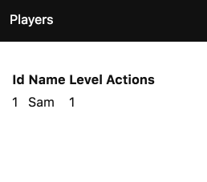

# 主程式（Main）

最後，修改 __src/Main.elm__ 呼叫 `initialModel`：

```elm
module Main exposing (..)

import Html.App
import Messages exposing (Msg)
import Models exposing (Model, initialModel)
import View exposing (view)
import Update exposing (update)

init : (Model, Cmd Msg)
init =
  (initialModel , Cmd.none)

subscriptions : Model -> Sub Msg
subscriptions model =
  Sub.none

-- 主程式

main =
  Html.App.program
    { init = init
    , view = view
    , update = update
    , subscriptions = subscriptions
    }
```

在匯入及 `init` 新增 `initialModel`。

---

當執行應用程式時，會看見列表中有一位用戶。



應用程式看起來像是 <https://github.com/sporto/elm-tutorial-app/tree/04-resources>
