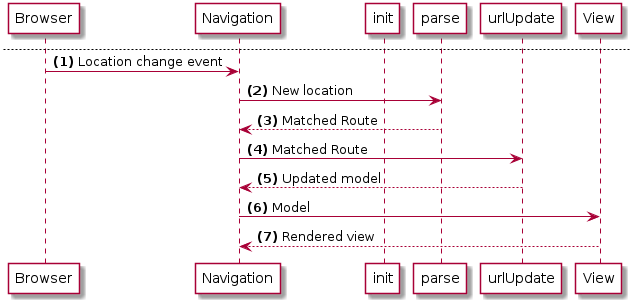

# 簡介

讓我們加入路由到應用程式。我們將使用 [Elm Navigation 包](http://package.elm-lang.org/packages/elm-lang/navigation/) 及 [UrlParser](http://package.elm-lang.org/packages/evancz/url-parser/)。

- Navigation 提供了更改瀏覽器網址及對應的方法
- UrlParser 提供路由比對器

首先進行安裝：

```bash
elm package install elm-lang/navigation 1.0.0
elm package install evancz/url-parser 1.0.0
```

 `Navigation` 函式庫包裝 `Html.App`。包含了 `Html.App` 所有功能並額外加上：

 - 監聽瀏覽器網址的更改
 - 當更改時，呼叫我們提供的函式
 - 提供改變瀏覽器網址的方法

## 流程

以下幾張圖表用來了解路由的運作。

### 初始轉譯


1. 當第一次讀取 `Navigation` 模組，將會擷取目前 URL 並送到我們所提供的 `parse` 函式。
1. `parse` 函式將會傳回符合的 `Route`。
1. Navigation 接著將符合的 `Route` 送到應用程式的 `init` 函式。
1. `init` 中我們建立應用程式模型。符合的路由儲存在此。
1. Navigation 接著發送初始的模型到視界進行應用程式轉譯。

### 當網址改變



1. 當瀏覽器網址改變時，Navigation 函式庫接收到事件
1. 新的網址送到與先前相同的 `parse` 函式
1. `parse` 傳回符合的路由
1. `Navigation` 接著呼叫我們提供的 `urlUpdate` 函式並帶入符合的路由
1. `urlUpdate` 中我們儲存符合的路由至應用程式模型並傳回更新後的模型
1. Navigation 接著如平常般轉譯應用程式
