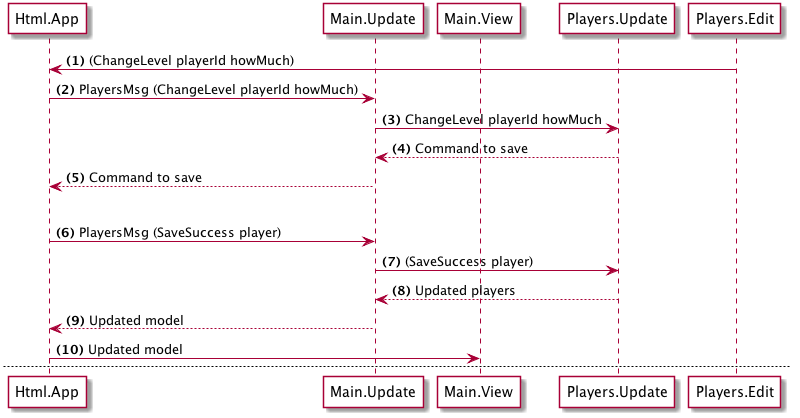

# Plan

The plan for changing a player's level is as follow:

(1) When the user clicks the increase or decrease button we trigger a message `ChangeLevel` with the `playerId` and `howMuch` as payload.

(2) __Html.App__ (which Navigation wraps) will send this message back to `Main.Update` which will route it to `Players.Update` (3).

(4) `Players.Update` will return a command to save the player, this command flows up to __Html.App__ (5).

(6) The Elm runtime executes the command (trigger an API call) and we will get a result back, either a succesful save or a failure. In the success case we trigger a `SaveSuccess` message with the updated player as payload.

(7) `Main.Update` routes the `SaveSuccess` message to `Players.Update`.

(8) In `Players.Update` we update the `players` model and return it. This flows back to Html.App (9).

(10) Then Html.App will render the application with the updated model.
